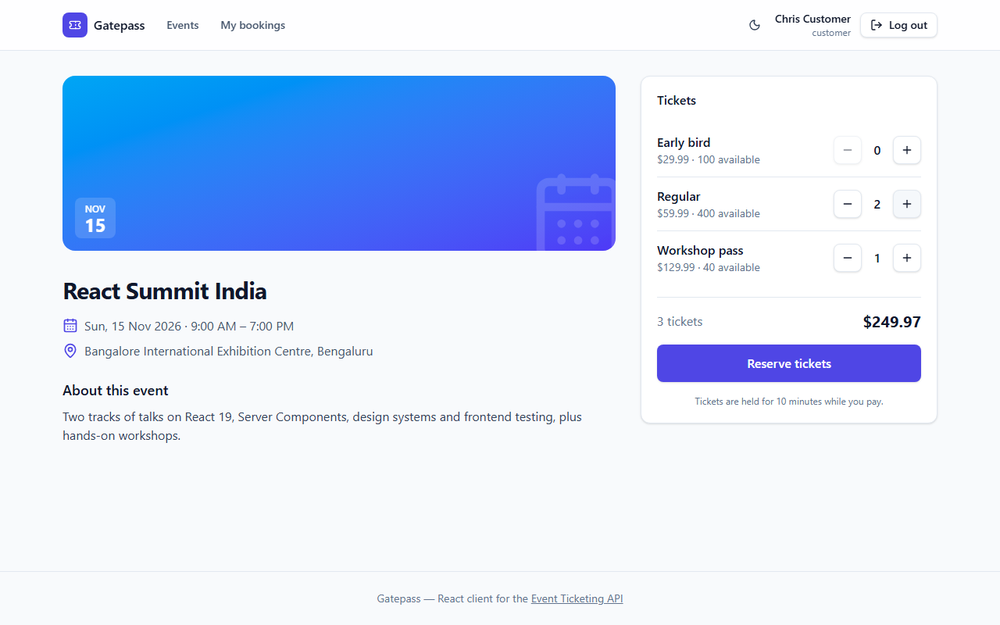
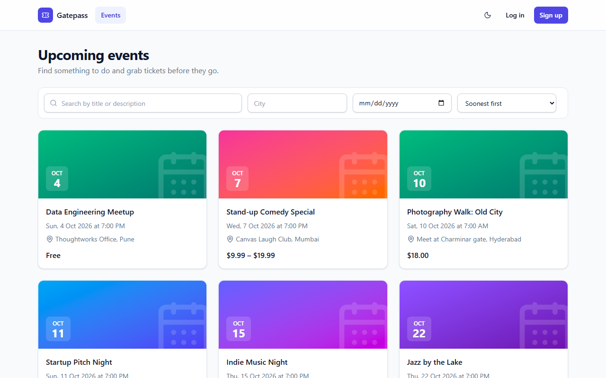
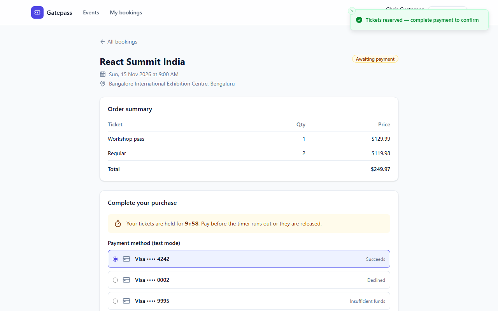
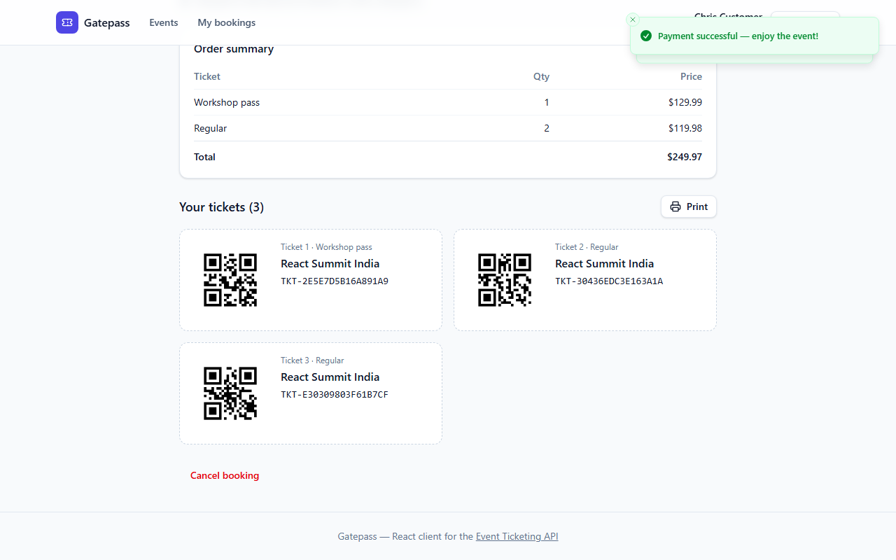
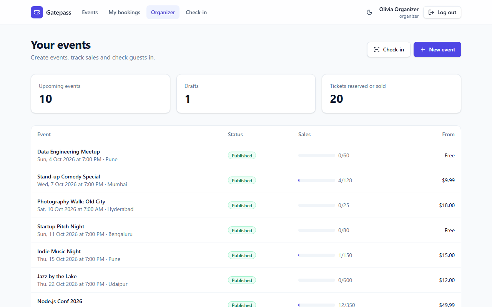
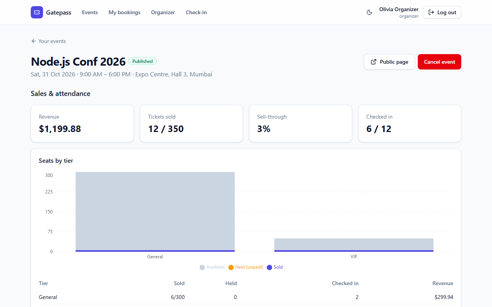
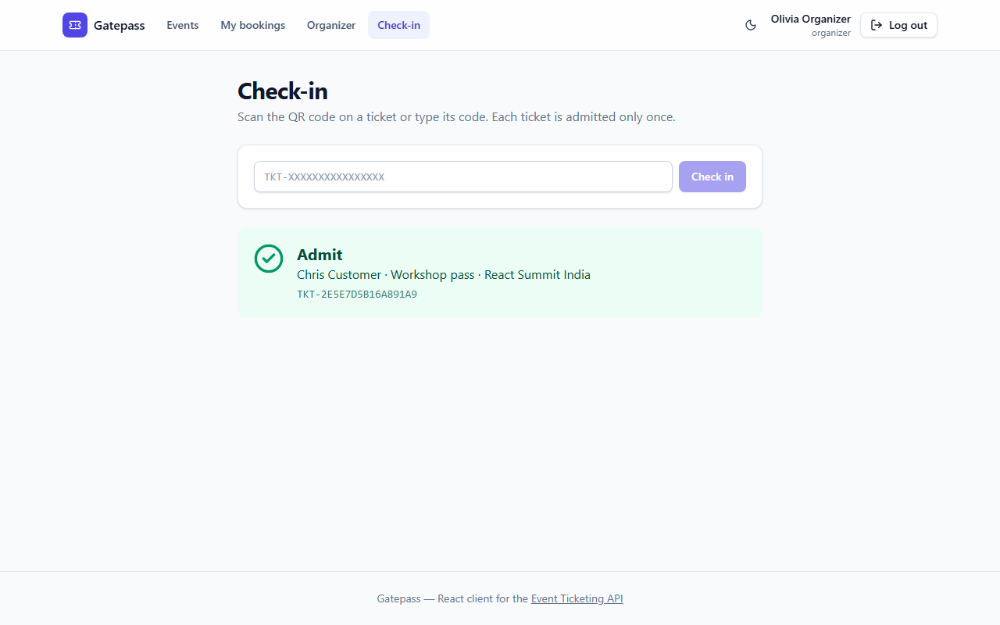
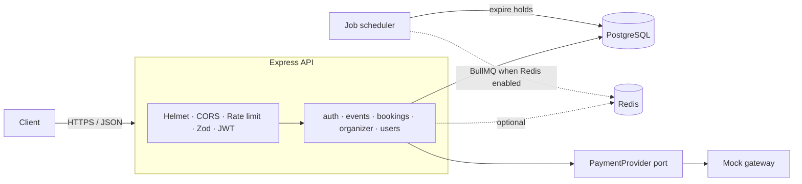
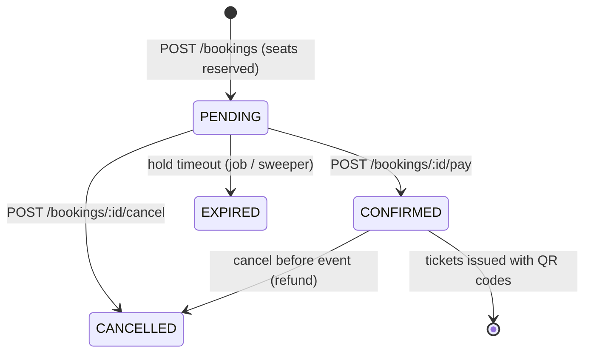

# Event Ticketing API + Gatepass web app

[](https://github.com/ebrahimmorkas/event-ticketing-api/actions/workflows/ci.yml)


A production-style backend for selling event tickets — think a small Ticketmaster/BookMyShow.
Organizers publish events with ticket tiers, customers reserve and pay for tickets, and staff
check attendees in at the door with QR codes.

The focus is on the problems real ticketing systems face: **thousands of buyers racing for the
last seats, retried payment requests, abandoned checkouts, and double-scanned tickets.**

It ships with **Gatepass**, a React + TypeScript web app in [`client/`](client) that covers
the whole product: browsing and booking for customers, a sales dashboard and QR check-in for
organizers, and user management for admins.



## Highlights

| Problem                                  | Solution                                                                                                                                                                                                          |
| ---------------------------------------- | ----------------------------------------------------------------------------------------------------------------------------------------------------------------------------------------------------------------- |
| Overselling under concurrent load        | One atomic conditional `UPDATE … WHERE reserved + n <= capacity RETURNING` per tier, plus a database `CHECK` constraint as a last line of defence. Covered by a test that fires 20 parallel purchases at 5 seats. |
| Duplicate bookings from client retries   | `Idempotency-Key` header on `POST /bookings`, backed by a unique index — including the race where two identical requests arrive simultaneously.                                                                   |
| Abandoned checkouts locking inventory    | Reservations are held for `BOOKING_HOLD_MINUTES`, then released by a delayed job (BullMQ) and a periodic sweeper safety net.                                                                                      |
| Payment confirmed after the hold expired | Payment confirmation is a conditional state transition; if it loses the race, the charge is refunded automatically.                                                                                               |
| The same ticket scanned at two gates     | Check-in is a conditional update, so a ticket is admitted exactly once.                                                                                                                                           |
| Stolen refresh tokens                    | Refresh tokens are single-use and stored hashed; replaying a used token revokes every session of that user.                                                                                                       |
| Needs Redis to run?                      | **No.** Redis is optional — every Redis-backed feature has an in-process fallback (see below).                                                                                                                    |

## Web client (Gatepass)

| Browse & search                                  | Checkout with a live hold timer                                  |
| ------------------------------------------------ | ---------------------------------------------------------------- |
|       |                        |
| **QR tickets**                                   | **Organizer dashboard**                                          |
|          |  |
| **Sales & attendance**                           | **Door check-in**                                                |
|  |                        |

What it does:

- **Customers** search events (text, city, date, sort; filters live in the URL), pick ticket
  tiers, reserve, pay with test cards inside a 10-minute hold, and get printable QR tickets.
- **Organizers** create events with ticket tiers, edit them, publish or cancel them, follow sales
  per tier on a chart, and check guests in by typing a code or scanning the QR with the camera.
- **Admins** change user roles.
- **One-click demo accounts** on the login page, so reviewers don't need to sign up.

How it is built:

- **React 19 + TypeScript + Vite**, React Router with lazy-loaded, role-guarded routes.
- **TanStack Query** for server state: cache keys per resource, invalidation after mutations,
  `keepPreviousData` for flicker-free pagination.
- **Auth that matches the API's security model**: the access token lives in memory only. Refresh
  tokens are single-use on the server, so refreshes go through a single in-flight promise plus a
  Web Lock across tabs. Parallel 401s never send the same refresh token twice, which would revoke
  every session.
- **Idempotent checkout**: each reservation attempt sends an `Idempotency-Key`, so a double click
  or a retry can never book twice.
- **Forms** with React Hook Form + Zod, mirroring the API's validation rules.
- **Tailwind CSS v4** with light and dark themes, responsive layouts, skeletons, and empty and
  error states with retry.
- **Accessibility**: labelled controls, keyboard-friendly native `<dialog>`, live regions for the
  check-in result, a data table behind every chart, and a skip link.
- **Tests**: Vitest + Testing Library for components and the API client; **Playwright** end-to-end
  tests run the real API and database in CI (buy tickets, declined card, publish an event,
  check-in once only).

## Tech stack

- **Frontend:** React 19, TypeScript, Vite, React Router, TanStack Query, React Hook Form, Zod,
  Tailwind CSS, Recharts, Playwright
- **Runtime:** Node.js 20+, TypeScript (strict, ESM), Express 5
- **Database:** PostgreSQL with Prisma ORM and migrations
- **Optional infrastructure:** Redis (ioredis) for caching and rate limiting, BullMQ for delayed jobs
- **Security:** JWT access tokens, rotating refresh tokens, bcrypt, Helmet, CORS, rate limiting, Zod validation
- **Observability:** structured JSON logging with pino, request logging, health endpoint
- **Docs:** OpenAPI 3.1 + Swagger UI
- **Testing:** Vitest + Supertest integration tests against a real PostgreSQL database
- **DevOps:** Docker multi-stage build, docker compose, GitHub Actions CI, Dependabot

## Architecture



The code is organised by feature (`src/modules/*`), each with its own routes, Zod schemas and
service layer. Infrastructure concerns live in `src/lib` behind small interfaces (`Cache`,
`JobScheduler`, `PaymentProvider`), so a backend can be swapped without touching business logic.

### Booking lifecycle



### Running with or without Redis

| Feature             | `REDIS_ENABLED=true`                     | `REDIS_ENABLED=false` (default) |
| ------------------- | ---------------------------------------- | ------------------------------- |
| Event listing cache | Redis, shared by all instances           | In-memory TTL cache (bounded)   |
| Rate limiting       | Redis store, consistent across instances | In-memory counters              |
| Booking-hold expiry | BullMQ delayed jobs with retries         | In-process timers               |
| Safety-net sweeper  | Runs every 30s                           | Runs every 30s                  |

CI runs the full test suite in **both** modes.

## Getting started

### Option 1 — Docker (quickest)

```bash
docker compose up --build                                   # web + API + PostgreSQL
REDIS_ENABLED=true docker compose --profile redis up --build # ... + Redis
```

The web app is at http://localhost:8080 (nginx serves the build and proxies `/api`), the API at
http://localhost:3000 and the interactive docs at http://localhost:3000/docs. Run the seed
(Option 2) against the container database to get the demo accounts and events.

### Option 2 — Local Node.js

Requirements: Node.js 20+, PostgreSQL 14+ (Redis optional).

```bash
git clone https://github.com/ebrahimmorkas/event-ticketing-api.git
cd event-ticketing-api
cp .env.example .env          # adjust DATABASE_URL if needed
npm install
npm run db:migrate            # apply migrations
npm run db:seed               # demo users + events
npm run dev                   # http://localhost:3000
```

Seeded accounts (password `Password123!`): `admin@example.com`, `organizer@example.com`,
`customer@example.com`.

### Try the purchase flow

```bash
# 1. Log in
TOKEN=$(curl -s localhost:3000/api/v1/auth/login -H 'Content-Type: application/json' \
  -d '{"email":"customer@example.com","password":"Password123!"}' | jq -r .accessToken)

# 2. Pick an event and tier
curl -s localhost:3000/api/v1/events | jq '.data[0] | {id, tiers}'

# 3. Reserve (safe to retry thanks to the idempotency key)
curl -s localhost:3000/api/v1/bookings -H "Authorization: Bearer $TOKEN" \
  -H 'Content-Type: application/json' -H 'Idempotency-Key: checkout-123' \
  -d '{"eventId":"<event-id>","items":[{"tierId":"<tier-id>","quantity":2}]}'

# 4. Pay (use pm_card_declined to simulate a failure)
curl -s localhost:3000/api/v1/bookings/<booking-id>/pay -H "Authorization: Bearer $TOKEN" \
  -H 'Content-Type: application/json' -d '{"paymentMethod":"pm_card_visa"}'

# 5. Get tickets with QR codes
curl -s localhost:3000/api/v1/bookings/<booking-id>/tickets -H "Authorization: Bearer $TOKEN"
```

## API overview

Full reference: **`/docs`** (Swagger UI) or [`docs/openapi.yaml`](docs/openapi.yaml).

| Method | Endpoint                             | Access    | Description                                           |
| ------ | ------------------------------------ | --------- | ----------------------------------------------------- |
| POST   | `/api/v1/auth/register`              | Public    | Register as customer or organizer                     |
| POST   | `/api/v1/auth/login`                 | Public    | Log in, receive access + refresh token                |
| POST   | `/api/v1/auth/refresh`               | Public    | Rotate refresh token                                  |
| POST   | `/api/v1/auth/logout`                | Public    | Revoke refresh token                                  |
| GET    | `/api/v1/auth/me`                    | User      | Current user                                          |
| GET    | `/api/v1/events`                     | Public    | Search upcoming events (filters, sorting, pagination) |
| GET    | `/api/v1/events/:id`                 | Public    | Event with live availability                          |
| POST   | `/api/v1/events`                     | Organizer | Create event with tiers                               |
| PATCH  | `/api/v1/events/:id`                 | Owner     | Update event                                          |
| POST   | `/api/v1/events/:id/publish`         | Owner     | Publish draft                                         |
| POST   | `/api/v1/events/:id/cancel`          | Owner     | Cancel event and its bookings                         |
| POST   | `/api/v1/events/:id/tiers`           | Owner     | Add ticket tier                                       |
| PATCH  | `/api/v1/events/:id/tiers/:tierId`   | Owner     | Update tier                                           |
| POST   | `/api/v1/bookings`                   | User      | Reserve tickets (`Idempotency-Key` supported)         |
| GET    | `/api/v1/bookings`                   | User      | My bookings                                           |
| POST   | `/api/v1/bookings/:id/pay`           | Owner     | Pay and confirm                                       |
| POST   | `/api/v1/bookings/:id/cancel`        | Owner     | Cancel (refund if paid)                               |
| GET    | `/api/v1/bookings/:id/tickets`       | Owner     | Tickets with QR codes                                 |
| POST   | `/api/v1/organizer/check-in`         | Organizer | Check a ticket in                                     |
| GET    | `/api/v1/organizer/events/:id/stats` | Organizer | Sales & attendance analytics                          |
| GET    | `/api/v1/users`                      | Admin     | List users                                            |
| PATCH  | `/api/v1/users/:id/role`             | Admin     | Change role                                           |
| GET    | `/health`                            | Public    | Liveness + dependency status                          |

Errors share one shape:

```json
{ "error": { "code": "SOLD_OUT", "message": "Not enough tickets available for the selected tier" } }
```

## Configuration

| Variable                 | Default                  | Description                                         |
| ------------------------ | ------------------------ | --------------------------------------------------- |
| `PORT`                   | `3000`                   | HTTP port                                           |
| `DATABASE_URL`           | —                        | PostgreSQL connection string (**required**)         |
| `JWT_ACCESS_SECRET`      | —                        | ≥ 32 chars (**required**)                           |
| `JWT_ACCESS_TTL`         | `15m`                    | Access token lifetime                               |
| `REFRESH_TOKEN_TTL_DAYS` | `7`                      | Refresh token lifetime                              |
| `REDIS_ENABLED`          | `false`                  | Toggle Redis-backed cache, rate limiting and BullMQ |
| `REDIS_URL`              | `redis://localhost:6379` | Redis connection                                    |
| `BOOKING_HOLD_MINUTES`   | `10`                     | How long unpaid reservations are held               |
| `RATE_LIMIT_WINDOW_MS`   | `60000`                  | Rate-limit window                                   |
| `RATE_LIMIT_MAX`         | `100`                    | Requests per window per IP                          |
| `AUTH_RATE_LIMIT_MAX`    | `10`                     | Auth requests per window per IP                     |
| `CORS_ORIGIN`            | `*`                      | Comma-separated allowed origins                     |
| `LOG_LEVEL`              | `info`                   | pino log level                                      |

The environment is validated at startup; the process exits with a clear message if anything is missing.

### Running the web client

With the API running on port 3000:

```bash
cd client
npm install
npm run dev                   # http://localhost:5173 — /api is proxied to :3000
```

Click a demo account on the login page. To point the client at an API on another origin, set
`VITE_API_URL` (see [`client/.env.example`](client/.env.example)) and add that origin to the
API's `CORS_ORIGIN`.

## Testing

```bash
npm test          # integration + unit tests (needs PostgreSQL)
npm run lint
npm run typecheck
```

Tests run against a real database (`ticketing_test` by default, override with
`TEST_DATABASE_URL`); migrations are applied automatically before the suite.

Web client:

```bash
cd client
npm test              # Vitest + Testing Library
npm run typecheck && npm run lint
npm run build && npm run test:e2e   # Playwright; starts the API and `vite preview`
```

The end-to-end tests expect a migrated and seeded database (`npm run db:deploy && npm run db:seed`).
CI runs them on every pull request against a PostgreSQL service container.

## Project structure

```
src/
├── app.ts                 # Express app factory
├── server.ts              # Bootstrap + graceful shutdown
├── routes.ts              # /api/v1 router + rate limits
├── config/env.ts          # Zod-validated environment
├── jobs/                  # Background job registration
├── lib/                   # prisma, redis, cache, jobs, tokens, logger, errors
├── middleware/            # auth, validation, rate limiting, error handling
└── modules/
    ├── auth/              # register, login, refresh rotation
    ├── bookings/          # reservations, payment, tickets, expiry
    ├── events/            # events + ticket tiers
    ├── organizer/         # check-in + analytics
    ├── payments/          # PaymentProvider port + mock gateway
    └── users/             # admin user management
prisma/                    # schema, migrations, seed
tests/                     # Vitest + Supertest suites
client/                    # Gatepass React app
├── src/
│   ├── lib/               # API client (token refresh, errors), formatting, theme
│   ├── components/        # layout, UI primitives, pagination
│   └── features/          # auth, events, bookings, organizer, admin
├── e2e/                   # Playwright specs
├── Dockerfile             # static build served by nginx
└── nginx.conf             # SPA fallback + /api reverse proxy
```

## Possible extensions

- Real payment gateway (Stripe/Razorpay) with webhook signature verification
- Email delivery of tickets via a queue worker
- Seat maps with assigned seating
- Waitlists that auto-offer released seats

## License

[MIT](LICENSE)
